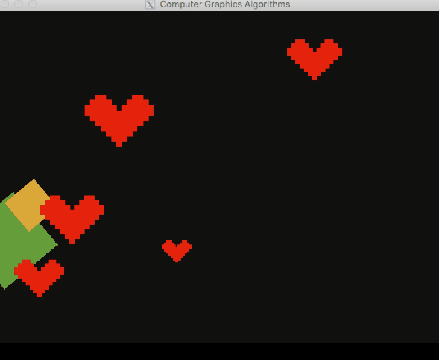
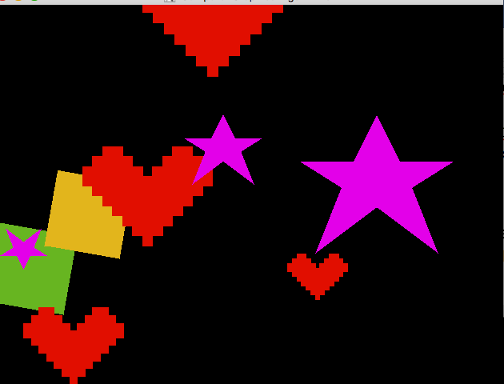
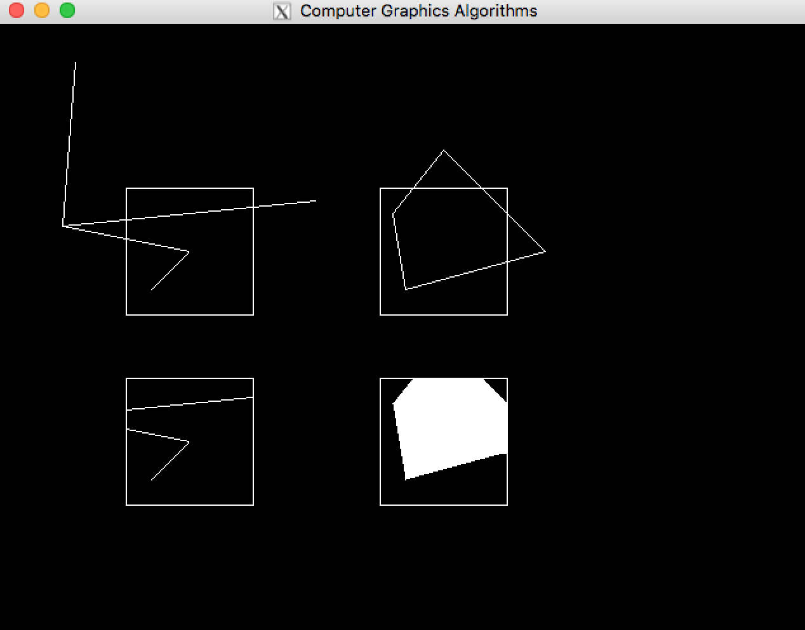
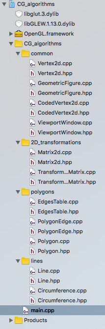

# CG Algorithms

This is our "mini Graphic Framework" that we build (in openGL) for the CG discipline Sao Paulo State University (UNESP).

  
*An Animation showing all algorithms together*

The current algorithms present here are:

- DDA algorithm for drawing lines
- Bresenham algorithm for drawing lines and circles
- Scan Line algorithm for filling polygons
- 2D transformations
- 2D Clipping (in ViewportWindows class)
  - clipLine - Cohen-Sutherland algorithm
  - clipPolygon - Hodgman-Sutherland algorithm

This is our release version, in order to present to the Professor Denis Salvadeo.

## Screenshots

  
*Some nice polygons*

  
*ClipLine and ClipPolygon in action*

  
*Our project structure*

## Authors

Lucas Pinheiro @lucaspin  
Dalton Lima @daltonbr
